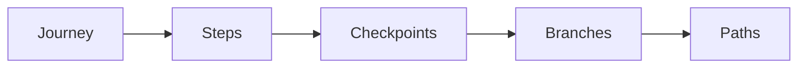

# Core Concepts

Understanding VenomQA's core concepts will help you write effective, maintainable tests.

## Overview

VenomQA is built around four key concepts:



<div class="feature-grid" markdown>

<div class="feature-card" markdown>

### [Journeys](journeys.md)

A complete user scenario from start to finish. Contains Steps, Checkpoints, and Branches.

</div>

<div class="feature-card" markdown>

### [Checkpoints & Branching](branching.md)

Save database state and fork execution to test multiple scenarios.

</div>

<div class="feature-card" markdown>

### [State Management](state.md)

How VenomQA manages database state for checkpointing and rollback.

</div>

<div class="feature-card" markdown>

### [Ports & Adapters](ports-adapters.md)

Clean architecture for swapping external dependencies.

</div>

</div>

## Quick Reference

### Journey

A journey represents a complete user scenario:

```python
from venomqa import Journey, Step

journey = Journey(
    name="user_registration",
    description="Test user registration flow",
    tags=["auth", "critical"],
    steps=[
        Step(name="register", action=register_user),
        Step(name="verify_email", action=verify_email),
        Step(name="login", action=login_user),
    ],
)
```

### Step

A single action in a journey:

```python
from venomqa import Step

Step(
    name="create_order",
    action=create_order,
    description="Create a new order",
    timeout=10.0,
    retries=3,
    expect_failure=False,
)
```

### Checkpoint

A savepoint for database state:

```python
from venomqa import Checkpoint

Checkpoint(name="order_created")
```

### Branch

Fork execution to test multiple paths:

```python
from venomqa import Branch, Path, Step

Branch(
    checkpoint_name="order_created",
    paths=[
        Path(name="card_payment", steps=[
            Step(name="pay_card", action=pay_with_card),
        ]),
        Path(name="wallet_payment", steps=[
            Step(name="pay_wallet", action=pay_with_wallet),
        ]),
    ],
)
```

### Context

Share data between steps:

```python
def login(client, context):
    response = client.post("/auth/login", json={...})
    context["token"] = response.json()["token"]  # Store
    return response

def get_orders(client, context):
    token = context["token"]  # Retrieve
    return client.get("/orders", headers={"Authorization": f"Bearer {token}"})
```

## How It All Fits Together

Here's a complete example showing all concepts:

```python
from venomqa import Journey, Step, Checkpoint, Branch, Path

def login(client, context):
    response = client.post("/api/auth/login", json={
        "email": "test@example.com",
        "password": "secret123",
    })
    if response.status_code == 200:
        context["token"] = response.json()["token"]
        client.set_auth_token(context["token"])
    return response

def add_to_cart(client, context):
    response = client.post("/api/cart/items", json={
        "product_id": 1,
        "quantity": 2,
    })
    context["cart_total"] = response.json()["total"]
    return response

def pay_with_card(client, context):
    return client.post("/api/checkout/pay", json={
        "method": "credit_card",
        "amount": context["cart_total"],
    })

def pay_with_wallet(client, context):
    return client.post("/api/checkout/pay", json={
        "method": "wallet",
        "amount": context["cart_total"],
    })

def pay_with_invalid_card(client, context):
    return client.post("/api/checkout/pay", json={
        "method": "credit_card",
        "card_token": "tok_declined",
    })

journey = Journey(
    name="checkout_flow",
    description="Test checkout with multiple payment methods",
    tags=["e-commerce", "critical"],
    steps=[
        # Setup phase
        Step(name="login", action=login),
        Step(name="add_to_cart", action=add_to_cart),

        # Checkpoint - save state here
        Checkpoint(name="cart_ready"),

        # Branch - test multiple paths from saved state
        Branch(
            checkpoint_name="cart_ready",
            paths=[
                # Happy path: credit card
                Path(name="credit_card", steps=[
                    Step(name="pay_card", action=pay_with_card),
                ]),

                # Happy path: wallet
                Path(name="wallet", steps=[
                    Step(name="pay_wallet", action=pay_with_wallet),
                ]),

                # Error path: declined card
                Path(name="declined", steps=[
                    Step(
                        name="pay_declined",
                        action=pay_with_invalid_card,
                        expect_failure=True,
                    ),
                ]),
            ],
        ),
    ],
)
```

When you run this journey:

1. `login` and `add_to_cart` execute once
2. At `Checkpoint("cart_ready")`, the database state is saved
3. For each `Path`:
   - Database is restored to the checkpoint
   - Context is restored to the checkpoint state
   - Path steps execute
4. After all paths complete, results are aggregated

## Mental Model

Think of VenomQA like version control for your test state:

| Git Concept | VenomQA Concept |
|-------------|-----------------|
| Repository | Journey |
| Commit | Checkpoint |
| Branch | Branch |
| Working tree | Execution Context |

Just as Git lets you branch from a commit and explore different changes, VenomQA lets you branch from a database checkpoint and explore different execution paths.

## Next Steps

Dive deeper into each concept:

- [Journeys](journeys.md) - The foundation of VenomQA testing
- [Checkpoints & Branching](branching.md) - State management and path exploration
- [State Management](state.md) - How checkpoints work under the hood
- [Ports & Adapters](ports-adapters.md) - Clean architecture for external dependencies
