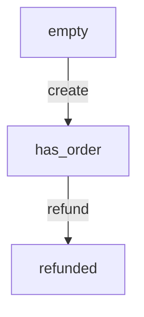

# Reporters

Generate reports from VenomQA exploration results.

## Overview

Reporters capture exploration output in various formats for analysis, CI integration, and team sharing.

```python
from venomqa.reporters import ConsoleReporter, HTMLTraceReporter

agent = Agent(...)

# Multiple reporters
result = agent.explore(reporter=[
    ConsoleReporter(verbose=True),
    HTMLTraceReporter(output_path="reports/trace.html"),
])
```

## Built-in Reporters

### ConsoleReporter

Default reporter that outputs to terminal.

```python
from venomqa.reporters import ConsoleReporter

reporter = ConsoleReporter(
    verbose=False,        # Show detailed output
    color=True,           # Colored output
    show_timestamps=True, # Include timestamps
    show_progress=True,   # Progress bar
)
```

**Output:**

```
VenomQA Exploration ─────────────────────────────
States visited:     25
Transitions:        87
Invariants checked: 261

╭─ CRITICAL VIOLATION ───────────────────────────╮
│ Invariant: no_over_refund                      │
│ Sequence: create → refund → refund             │
│ Details:  Refunded $200 on $100 order          │
╰────────────────────────────────────────────────╯

Summary: 25 states, 1 violation
Duration: 4.2s
```

---

### HTMLTraceReporter

Generates an interactive HTML visualization.

```python
from venomqa.reporters import HTMLTraceReporter

reporter = HTMLTraceReporter(
    output_path="reports/trace.html",
    include_graph=True,     # D3 force graph
    include_timeline=True,  # Timeline view
    theme="dark",           # "dark" or "light"
    title="API Exploration",
)
```

**Features:**

- Interactive state graph (D3.js)
- Path timeline
- Violation details
- Response previews
- Filterable by status, action, invariant

---

### JSONReporter

Exports results as JSON for programmatic processing.

```python
from venomqa.reporters import JSONReporter

reporter = JSONReporter(
    output_path="reports/results.json",
    pretty_print=True,      # Human-readable
    include_responses=True, # Full response data
    include_context=True,   # Context snapshots
)
```

**Output Structure:**

```json
{
  "summary": {
    "states_visited": 25,
    "transitions": 87,
    "invariants_checked": 261,
    "violations": 1,
    "duration_seconds": 4.2
  },
  "violations": [
    {
      "invariant_name": "no_over_refund",
      "severity": "CRITICAL",
      "path": ["create_order", "refund_order", "refund_order"],
      "message": "Refunded $200 on $100 order",
      "context": {...},
      "timestamp": "2024-01-15T10:30:00Z"
    }
  ],
  "states": [...],
  "transitions": [...]
}
```

---

### JUnitReporter

Generates JUnit XML for CI/CD integration.

```python
from venomqa.reporters import JUnitReporter

reporter = JUnitReporter(
    output_path="reports/junit.xml",
    suite_name="VenomQA",
)
```

**Output:**

```xml
<?xml version="1.0" encoding="UTF-8"?>
<testsuites>
  <testsuite name="VenomQA" tests="261" failures="1" time="4.2">
    <testcase name="create_order" classname="actions" time="0.1"/>
    <testcase name="refund_order" classname="actions" time="0.08"/>
    <testcase name="invariant.no_over_refund" classname="invariants" time="0.01">
      <failure message="Refunded $200 on $100 order">
        Path: create_order → refund_order → refund_order
      </failure>
    </testcase>
  </testsuite>
</testsuites>
```

**CI Integration:**

- **GitHub Actions**: Shows in test summary
- **GitLab CI**: Displays in pipeline view
- **Jenkins**: Parsed by JUnit plugin
- **CircleCI**: Test summary integration

---

### MarkdownReporter

Generates a markdown summary.

```python
from venomqa.reporters import MarkdownReporter

reporter = MarkdownReporter(
    output_path="reports/summary.md",
    include_mermaid=True,  # Mermaid diagrams
)
```

**Output:**

```markdown
# VenomQA Exploration Report

## Summary

| Metric | Value |
|--------|-------|
| States visited | 25 |
| Transitions | 87 |
| Violations | 1 |
| Duration | 4.2s |

## Violations

### CRITICAL: no_over_refund

**Path:** `create_order → refund_order → refund_order`

**Message:** Refunded $200 on $100 order

## State Graph


```

---

## Custom Reporters

Create custom reporters by implementing the Reporter protocol.

```python
from typing import List
from venomqa.reporters.base import Reporter
from venomqa.core import Violation, ExplorationResult

class SlackReporter(Reporter):
    """Post results to Slack."""
    
    def __init__(self, webhook_url: str, channel: str = "#qa"):
        self.webhook_url = webhook_url
        self.channel = channel
    
    def on_violation(self, violation: Violation) -> None:
        """Called when a violation is found."""
        import requests
        
        color = {
            "CRITICAL": "#FF0000",
            "HIGH": "#FF6600",
            "MEDIUM": "#FFCC00",
            "LOW": "#666666",
        }.get(violation.severity.name, "#666666")
        
        requests.post(self.webhook_url, json={
            "channel": self.channel,
            "attachments": [{
                "color": color,
                "title": f"VenomQA: {violation.invariant_name}",
                "text": violation.message,
                "fields": [{
                    "title": "Sequence",
                    "value": " → ".join(violation.path),
                    "short": False,
                }],
            }],
        })
    
    def on_complete(self, result: ExplorationResult) -> None:
        """Called when exploration completes."""
        import requests
        
        status = "✅ Passed" if not result.violations else "❌ Failed"
        
        requests.post(self.webhook_url, json={
            "channel": self.channel,
            "text": f"VenomQA complete: {status}\n"
                    f"States: {result.states_visited}, "
                    f"Violations: {len(result.violations)}",
        })
```

**Using Custom Reporters:**

```python
from reporters.slack import SlackReporter

slack = SlackReporter(
    webhook_url="https://hooks.slack.com/services/...",
    channel="#qa-alerts",
)

result = agent.explore(reporter=[slack, ConsoleReporter()])
```

---

## Reporter Protocol

```python
class Reporter(Protocol):
    def on_start(self) -> None:
        """Called when exploration starts."""
        ...
    
    def on_action(self, action: str, result: ActionResult) -> None:
        """Called after each action."""
        ...
    
    def on_invariant(self, invariant: str, passed: bool) -> None:
        """Called after each invariant check."""
        ...
    
    def on_violation(self, violation: Violation) -> None:
        """Called when a violation is found."""
        ...
    
    def on_complete(self, result: ExplorationResult) -> None:
        """Called when exploration completes."""
        ...
```

---

## Combining Reporters

```python
from venomqa.reporters import (
    ConsoleReporter,
    HTMLTraceReporter,
    JSONReporter,
    JUnitReporter,
)

# All reporters receive events
reporters = [
    ConsoleReporter(verbose=True),
    HTMLTraceReporter(output_path="reports/trace.html"),
    JSONReporter(output_path="reports/results.json"),
    JUnitReporter(output_path="reports/junit.xml"),
]

result = agent.explore(reporter=reporters)
```

---

## CLI Usage

```bash
# Single reporter
venomqa run qa/ --report html --output reports/

# Multiple reporters
venomqa run qa/ \
  --report html \
  --report json \
  --report junit \
  --output reports/
```

## Next Steps

- [CLI Reference](cli.md) - Command-line options
- [CI/CD Integration](../tutorials/ci-cd.md) - Use in pipelines
- [API Reference](api.md) - Programmatic usage
