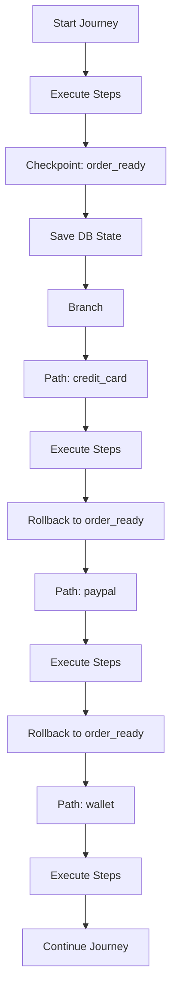

# Checkpoints & Branching

Checkpoints and branching are VenomQA's most powerful features. They let you save database state and test multiple scenarios from the same starting point.

## The Problem

Without state management, testing multiple scenarios requires:

1. Running the same setup steps repeatedly
2. Cleaning up data between tests
3. Dealing with flaky tests from inconsistent state

```
Traditional Testing:
Test 1: Login → Add to Cart → Pay with Card
Test 2: Login → Add to Cart → Pay with Wallet (repeat setup!)
Test 3: Login → Add to Cart → Pay with PayPal (repeat again!)
```

## The Solution: Checkpoints

VenomQA lets you save state at a **checkpoint** and branch from there:

```
VenomQA Testing:
Login → Add to Cart → [CHECKPOINT: cart_ready]
                            │
                            ├── Pay with Card
                            ├── Pay with Wallet
                            └── Pay with PayPal
```

Each branch starts from the **exact same state** - no repeated setup, no flaky tests.

## Checkpoints

### Creating a Checkpoint

A checkpoint saves the database state at a specific point:

```python
from venomqa import Journey, Step, Checkpoint

journey = Journey(
    name="order_testing",
    steps=[
        Step(name="login", action=login),
        Step(name="create_order", action=create_order),
        Checkpoint(name="order_created"),  # Save state here
        Step(name="process_order", action=process_order),
    ],
)
```

### When to Use Checkpoints

Place checkpoints **before** operations where you want to test multiple scenarios:

```python
Journey(
    name="payment_flows",
    steps=[
        Step(name="login", action=login),
        Step(name="add_to_cart", action=add_to_cart),
        Checkpoint(name="cart_ready"),      # Before payment
        Step(name="checkout", action=checkout),
        Checkpoint(name="order_pending"),   # Before payment processing
        # Branch here to test different payment methods
    ],
)
```

### How Checkpoints Work

Under the hood, VenomQA uses database transactions:

```sql
-- Creating a checkpoint
SAVEPOINT chk_order_created;

-- Rolling back to checkpoint
ROLLBACK TO SAVEPOINT chk_order_created;

-- Releasing checkpoint (cleanup)
RELEASE SAVEPOINT chk_order_created;
```

## Branches

### Basic Branching

A Branch tests multiple paths from a checkpoint:

```python
from venomqa import Journey, Step, Checkpoint, Branch, Path

journey = Journey(
    name="checkout_flows",
    steps=[
        Step(name="login", action=login),
        Step(name="add_items", action=add_items),
        Checkpoint(name="items_added"),
        Branch(
            checkpoint_name="items_added",
            paths=[
                Path(name="standard_checkout", steps=[
                    Step(name="checkout_standard", action=checkout_standard),
                ]),
                Path(name="express_checkout", steps=[
                    Step(name="checkout_express", action=checkout_express),
                ]),
            ],
        ),
    ],
)
```

### Branch Parameters

| Parameter | Type | Description |
|-----------|------|-------------|
| `checkpoint_name` | `str` | Name of the checkpoint to rollback to |
| `paths` | `list[Path]` | List of paths to explore |

### Path Parameters

| Parameter | Type | Default | Description |
|-----------|------|---------|-------------|
| `name` | `str` | Required | Unique identifier for the path |
| `steps` | `list` | Required | Steps to execute in this path |
| `description` | `str` | `""` | Human-readable description |

## Real-World Example: Payment Testing

```python
def pay_with_card(client, context):
    return client.post("/api/payments", json={
        "order_id": context["order_id"],
        "method": "credit_card",
        "card_number": "4242424242424242",
    })

def pay_with_paypal(client, context):
    return client.post("/api/payments", json={
        "order_id": context["order_id"],
        "method": "paypal",
    })

def pay_with_wallet(client, context):
    return client.post("/api/payments", json={
        "order_id": context["order_id"],
        "method": "wallet",
    })

def pay_insufficient_funds(client, context):
    return client.post("/api/payments", json={
        "order_id": context["order_id"],
        "method": "credit_card",
        "card_number": "4000000000000002",  # Test card that declines
    })

journey = Journey(
    name="payment_methods",
    steps=[
        Step(name="setup_order", action=setup_order),
        Checkpoint(name="order_ready"),
        Branch(
            checkpoint_name="order_ready",
            paths=[
                Path(name="credit_card", steps=[
                    Step(name="pay_card", action=pay_with_card),
                ]),
                Path(name="paypal", steps=[
                    Step(name="pay_paypal", action=pay_with_paypal),
                ]),
                Path(name="wallet", steps=[
                    Step(name="pay_wallet", action=pay_with_wallet),
                ]),
                Path(name="declined", steps=[
                    Step(
                        name="pay_declined",
                        action=pay_insufficient_funds,
                        expect_failure=True,
                    ),
                ]),
            ],
        ),
    ],
)
```

## How Rollback Works

When a Branch is encountered:



1. **Save Context**: Snapshot the execution context (variables, tokens, etc.)
2. **Execute Path**: Run all steps in the path
3. **Rollback Database**: Restore database to checkpoint state
4. **Restore Context**: Reset context to snapshot
5. **Next Path**: Repeat for each path

## Nested Checkpoints

You can create checkpoints inside branch paths:

```python
journey = Journey(
    name="complex_flows",
    steps=[
        Step(name="login", action=login),
        Checkpoint(name="authenticated"),
        Step(name="create_order", action=create_order),
        Checkpoint(name="order_created"),
        Branch(
            checkpoint_name="order_created",
            paths=[
                Path(name="full_payment", steps=[
                    Step(name="process_payment", action=process_payment),
                    Checkpoint(name="payment_done"),  # Nested checkpoint
                    Step(name="ship_order", action=ship_order),
                ]),
                Path(name="partial_payment", steps=[
                    Step(name="pay_deposit", action=pay_deposit),
                    Checkpoint(name="deposit_paid"),  # Another nested checkpoint
                    Step(name="pay_remainder", action=pay_remainder),
                ]),
            ],
        ),
    ],
)
```

## Context Behavior in Branches

### What Gets Restored

When rolling back to a checkpoint:

- **Database state**: Fully restored via SAVEPOINT
- **Context variables**: Restored to snapshot at checkpoint time
- **Auth tokens**: Preserved from context

### What Persists

Across paths in a branch:

- **Client connection**: Same HTTP client
- **Auth headers**: Unless explicitly cleared

### Example

```python
def setup_user(client, context):
    # This runs once before checkpoint
    context["user_id"] = create_user()
    context["token"] = login()
    return response

def path_a_action(client, context):
    # Can access context["user_id"] and context["token"]
    # Modifications here are reset for next path
    context["path_a_data"] = "data"
    return client.get("/api/something")

def path_b_action(client, context):
    # context["path_a_data"] does NOT exist here
    # We're starting fresh from the checkpoint
    return client.get("/api/other")
```

## Best Practices

### 1. Use Meaningful Checkpoint Names

```python
# Good
Checkpoint(name="user_authenticated")
Checkpoint(name="order_created")
Checkpoint(name="payment_completed")

# Bad
Checkpoint(name="cp1")
Checkpoint(name="save_here")
```

### 2. Place Checkpoints Strategically

Checkpoint before operations where you want to test multiple outcomes:

```python
# Good: Checkpoint before the fork point
Step(name="create_order", action=create_order),
Checkpoint(name="order_ready"),  # Multiple payment methods from here
Branch(checkpoint_name="order_ready", ...)

# Bad: Checkpoint too early
Checkpoint(name="start"),  # Too much to repeat
Step(name="login", action=login),
Step(name="add_items", action=add_items),
Step(name="create_order", action=create_order),
Branch(checkpoint_name="start", ...)
```

### 3. Keep Paths Focused

Each path should test **one specific scenario**:

```python
# Good: Focused paths
Branch(
    checkpoint_name="order_ready",
    paths=[
        Path(name="card_success", steps=[
            Step(name="pay_card", action=pay_with_valid_card),
        ]),
        Path(name="card_declined", steps=[
            Step(name="pay_card", action=pay_with_declined_card, expect_failure=True),
        ]),
        Path(name="card_expired", steps=[
            Step(name="pay_card", action=pay_with_expired_card, expect_failure=True),
        ]),
    ],
)
```

### 4. Test Both Success and Failure Paths

```python
Branch(
    checkpoint_name="checkout_ready",
    paths=[
        # Happy paths
        Path(name="success_card", steps=[...]),
        Path(name="success_wallet", steps=[...]),

        # Error paths
        Path(name="error_insufficient_funds", steps=[
            Step(name="pay", action=pay_insufficient, expect_failure=True),
        ]),
        Path(name="error_invalid_card", steps=[
            Step(name="pay", action=pay_invalid_card, expect_failure=True),
        ]),
    ],
)
```

### 5. Document Path Purpose

```python
Path(
    name="international_shipping",
    description="Test checkout with international shipping address and customs handling",
    steps=[...],
)
```

## Limitations

### Database Backend Required

Full checkpoint/rollback requires a database that supports transactions:

- PostgreSQL: Fully supported
- MySQL: Supported (with InnoDB)
- SQLite: Limited support

Without a database backend, checkpoints only save context state, not database changes.

### Parallel Path Execution

When running paths in parallel (`parallel_paths > 1`), be aware:

- Each path may need its own database connection
- Paths may interfere with each other if not properly isolated
- Use `parallel_paths=1` when state isolation is critical

### Transaction Scope

Checkpoints work within a single transaction. If your application uses multiple databases or external services, only the primary database is rolled back.

## Debugging Tips

### Enable Verbose Logging

```bash
venomqa run my_journey -v
```

Look for checkpoint operations:

```
DEBUG - Created checkpoint: chk_order_created
DEBUG - Rolled back to checkpoint: chk_order_created
```

### Verify Checkpoint Order

Ensure checkpoints are created before branches reference them:

```python
# Correct
Checkpoint(name="order_created"),
Branch(checkpoint_name="order_created", ...)

# Wrong - will fail
Branch(checkpoint_name="order_created", ...)
Checkpoint(name="order_created"),  # Too late!
```

## Next Steps

- [State Management](state.md) - Deep dive into how state management works
- [Database Backends](../reference/backends.md) - Configure different database backends
- [Tutorials](../tutorials/index.md) - Step-by-step guides for common scenarios
