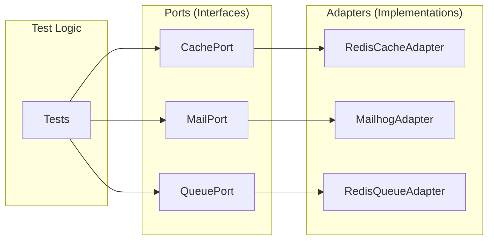

# Ports & Adapters

VenomQA uses the **Ports and Adapters** (Hexagonal) architecture pattern for clean separation between test logic and external dependencies.

## Overview

The architecture has two key components:

- **Ports**: Abstract interfaces defining what operations your tests need
- **Adapters**: Concrete implementations for real services



## Why Ports & Adapters?

### Benefits

1. **Testability**: Swap real services for mocks in unit tests
2. **Flexibility**: Change infrastructure without modifying test code
3. **Clarity**: Clear contracts between test logic and external systems
4. **Portability**: Same tests work across different environments

### Example

```python
# Your test logic uses the abstract port
from venomqa.ports import CachePort

def test_user_caching(cache: CachePort):
    cache.set("user:1", {"name": "John"})
    user = cache.get("user:1")
    assert user["name"] == "John"

# In production tests, use Redis
from venomqa.adapters import RedisCacheAdapter
cache = RedisCacheAdapter(host="redis.prod.internal")
test_user_caching(cache)

# In unit tests, use a mock
from unittest.mock import Mock
cache = Mock(spec=CachePort)
cache.get.return_value = {"name": "John"}
test_user_caching(cache)
```

## Available Ports

VenomQA provides ports for common external dependencies:

| Port | Purpose |
|------|---------|
| `CachePort` | Key-value caching (Redis, Memcached) |
| `MailPort` | Email sending and verification |
| `QueuePort` | Job/task queues (Celery, RQ) |
| `SearchPort` | Full-text search (Elasticsearch) |
| `StoragePort` | File/blob storage (S3, local) |
| `TimePort` | Time control for testing |
| `MockPort` | HTTP mocking (WireMock) |
| `WebSocketPort` | WebSocket connections |
| `DatabasePort` | Database operations |
| `NotificationPort` | Push notifications, SMS |

## Available Adapters

| Category | Adapters |
|----------|----------|
| **Email** | `MailhogAdapter`, `MailpitAdapter`, `SMTPMockAdapter` |
| **Cache** | `RedisCacheAdapter` |
| **Queue** | `RedisQueueAdapter`, `CeleryQueueAdapter` |
| **Search** | `ElasticsearchAdapter` |
| **Storage** | `S3StorageAdapter`, `LocalStorageAdapter` |
| **Mock** | `WireMockAdapter` |
| **Time** | `ControllableTimeAdapter`, `RealTimeAdapter` |
| **Concurrency** | `ThreadingConcurrencyAdapter`, `AsyncConcurrencyAdapter` |

## Using Ports in Tests

### Email Testing

```python
from venomqa.ports import MailPort
from venomqa.adapters import MailhogAdapter

def test_password_reset_email(mail: MailPort):
    # Trigger password reset
    client.post("/api/auth/forgot-password", json={
        "email": "user@example.com"
    })

    # Wait for email to arrive
    email = mail.wait_for_email(
        to="user@example.com",
        subject="Password Reset",
        timeout=30.0,
    )

    assert email is not None
    assert "reset" in email.body.lower()

# Create adapter and run test
mail = MailhogAdapter(host="localhost", port=8025)
test_password_reset_email(mail)
```

### Cache Testing

```python
from venomqa.ports import CachePort
from venomqa.adapters import RedisCacheAdapter

def test_session_caching(cache: CachePort):
    # Set session with TTL
    cache.set("session:abc123", {"user_id": 1}, ttl=3600)

    # Verify it exists
    assert cache.exists("session:abc123")

    # Get the value
    session = cache.get("session:abc123")
    assert session["user_id"] == 1

    # Check TTL
    ttl = cache.get_ttl("session:abc123")
    assert 0 < ttl <= 3600

cache = RedisCacheAdapter(host="localhost", port=6379)
test_session_caching(cache)
```

### Queue Testing

```python
from venomqa.ports import QueuePort
from venomqa.adapters import RedisQueueAdapter

def test_job_processing(queue: QueuePort):
    # Clear the queue
    queue.clear_queue("notifications")

    # Enqueue a job
    job_id = queue.enqueue(
        "myapp.tasks.send_notification",
        user_id=123,
        message="Hello!",
        queue="notifications",
    )

    # Check job was queued
    job = queue.get_job(job_id)
    assert job.status in ["pending", "queued"]

    # Wait for completion (requires worker)
    result = queue.get_job_result(job_id, timeout=60.0)
    assert result.success

queue = RedisQueueAdapter(host="localhost")
test_job_processing(queue)
```

### Time Control

```python
from datetime import timedelta
from venomqa.adapters import ControllableTimeAdapter

def test_token_expiration():
    time = ControllableTimeAdapter()
    time.freeze()

    # Create token that expires in 1 hour
    token = create_token(expires_in=3600)
    assert token.is_valid()

    # Fast forward 59 minutes - still valid
    time.advance(timedelta(minutes=59))
    assert token.is_valid()

    # Fast forward 1 more minute - expired
    time.advance(timedelta(minutes=1))
    assert not token.is_valid()
```

### Mock Server

```python
from venomqa.adapters import WireMockAdapter
from venomqa import Client

def test_with_mock_api():
    mock = WireMockAdapter(port=8080)

    # Stub an endpoint
    mock.stub(
        "GET",
        "/api/external/users/1",
        body={"id": 1, "name": "John Doe"},
        status_code=200,
    )

    # Use mocked API
    client = Client(base_url=mock.get_base_url())
    response = client.get("/api/external/users/1")

    assert response.status_code == 200
    assert response.json()["name"] == "John Doe"

    # Verify request was made
    assert mock.verify("GET", "/api/external/users/1", count=1)

    mock.reset()
```

## Dependency Injection

### Using pytest Fixtures

```python
import pytest
from venomqa.ports import CachePort, MailPort
from venomqa.adapters import RedisCacheAdapter, MailhogAdapter

@pytest.fixture
def cache() -> CachePort:
    adapter = RedisCacheAdapter(host="localhost")
    yield adapter
    adapter.clear()

@pytest.fixture
def mail() -> MailPort:
    adapter = MailhogAdapter(host="localhost")
    adapter.delete_all_emails()  # Clean start
    yield adapter
    adapter.delete_all_emails()  # Clean up

def test_user_registration(cache: CachePort, mail: MailPort):
    # Test using injected adapters
    pass
```

### Using in Journeys

```python
from venomqa import Journey, Step
from venomqa.adapters import MailhogAdapter

mail = MailhogAdapter(host="localhost")

def verify_welcome_email(client, context):
    email = mail.wait_for_email(
        to=context["user_email"],
        subject="Welcome",
        timeout=30.0,
    )
    if email is None:
        raise AssertionError("Welcome email not received")
    return {"email_received": True}

journey = Journey(
    name="registration_flow",
    steps=[
        Step(name="register", action=register_user),
        Step(name="verify_email", action=verify_welcome_email),
    ],
)
```

## Creating Custom Adapters

Implement a port interface to create custom adapters:

```python
from venomqa.ports import CachePort, CacheEntry
from typing import Any

class MemoryCacheAdapter(CachePort):
    """In-memory cache for testing."""

    def __init__(self):
        self._data: dict[str, CacheEntry] = {}

    def get(self, key: str) -> Any | None:
        entry = self._data.get(key)
        if entry is None:
            return None
        if entry.is_expired():
            del self._data[key]
            return None
        return entry.value

    def set(self, key: str, value: Any, ttl: int | None = None) -> bool:
        self._data[key] = CacheEntry(
            key=key,
            value=value,
            ttl=ttl,
        )
        return True

    def delete(self, key: str) -> bool:
        if key in self._data:
            del self._data[key]
            return True
        return False

    def exists(self, key: str) -> bool:
        return self.get(key) is not None

    def clear(self) -> bool:
        self._data.clear()
        return True

    # ... implement other required methods
```

## Adapter Registration

Register custom adapters for discovery:

```python
from venomqa.adapters import register_adapter

@register_adapter("memory_cache")
class MemoryCacheAdapter(CachePort):
    pass

# Or register directly
from venomqa.adapters import register_adapter_class
register_adapter_class("memory_cache", MemoryCacheAdapter)

# Retrieve registered adapters
from venomqa.adapters import get_adapter, list_adapters

adapter_class = get_adapter("memory_cache")
all_adapters = list_adapters()
```

## Environment-Based Adapters

Switch adapters based on environment:

```python
import os
from venomqa.ports import CachePort
from venomqa.adapters import RedisCacheAdapter

def get_cache_adapter() -> CachePort:
    env = os.environ.get("ENV", "local")

    if env == "production":
        return RedisCacheAdapter(
            host="redis.prod.internal",
            password=os.environ["REDIS_PASSWORD"],
        )
    elif env == "staging":
        return RedisCacheAdapter(host="redis.staging.internal")
    else:
        return RedisCacheAdapter(host="localhost")
```

## Best Practices

### 1. Program to Interfaces

```python
# Good - depends on abstract port
def test_feature(cache: CachePort):
    cache.set("key", "value")

# Bad - depends on concrete implementation
def test_feature(cache: RedisCacheAdapter):
    cache.set("key", "value")
```

### 2. Clean Up After Tests

```python
@pytest.fixture
def mail():
    adapter = MailhogAdapter()
    adapter.delete_all_emails()  # Before
    yield adapter
    adapter.delete_all_emails()  # After
```

### 3. Use Type Hints

```python
from venomqa.ports import CachePort, MailPort

def test_feature(
    cache: CachePort,
    mail: MailPort,
) -> None:
    # Type checker knows the interface
    pass
```

### 4. Health Check Services

```python
@pytest.fixture(scope="session", autouse=True)
def verify_services():
    services = [
        ("Redis", RedisCacheAdapter()),
        ("MailHog", MailhogAdapter()),
    ]

    unhealthy = []
    for name, adapter in services:
        if not adapter.health_check():
            unhealthy.append(name)

    if unhealthy:
        pytest.skip(f"Services not available: {', '.join(unhealthy)}")
```

## Next Steps

- [Adapters Reference](../reference/adapters.md) - All available adapters
- [Custom Backends](../advanced/custom-backends.md) - Implement custom adapters
- [API Reference](../reference/api.md) - Complete port interfaces
